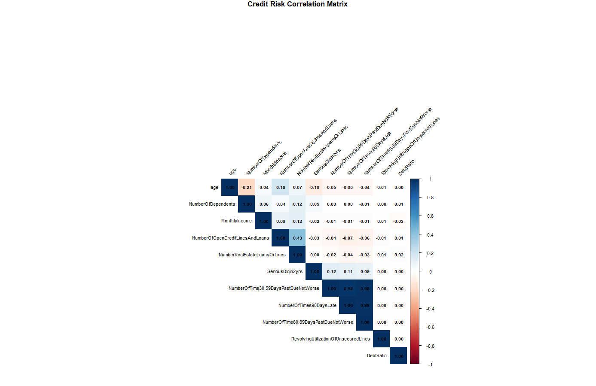
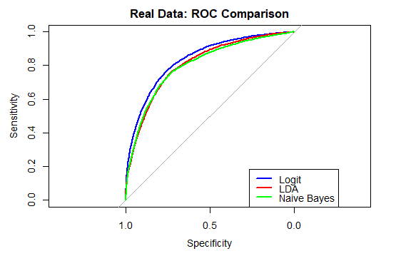

# **Credit Default Risk Prediction: A Parametric Comparative Study**

## **📌 Executive Summary**

**The Problem:** Credit default is a major driver of financial loss in the banking sector. Identifying high-risk applicants before loan disbursement is critical for maintaining a healthy loan portfolio and reducing charge-offs.

**The Solution:** Using a real-world dataset of **150,000 observations**, I engineered a robust predictive pipeline in **R**. I implemented and compared three fundamental parametric models—**Logistic Regression, Linear Discriminant Analysis (LDA), and Naive Bayes**—to determine which algorithm best identifies potential defaulters in a highly imbalanced environment.

**The Result:** * **Top Performer:** **Logistic Regression** emerged as the superior model for risk mitigation, achieving an **ROC-AUC of 0.8354**.

* **Key Strategy:** By implementing **Down-sampling**, I successfully pivoted the model from a "biased" state (which favored the majority class) to a "risk-aware" state that accurately identifies **74.59% of actual defaulters (Recall)**.

---

## **🛠️ Tech Stack & Libraries**

* **Language:** R
* **Core Libraries:** `tidyverse` (Data Manipulation), `caret` (Preprocessing & Partitioning), `MASS` (LDA), `e1071` (Naive Bayes), `pROC` (AUC Metrics), `car` (VIF Diagnostics).

---
## 📂 Data Description
The dataset contains 11 financial and demographic attributes used to determine the probability of a borrower experiencing financial distress.

| Variable | Description | Type |
| :--- | :--- | :--- |
| **SeriousDlqin2yrs** | Person experienced 90 days past due delinquency or worse | **Target** |
| **RevolvingUtilization...** | Total balance on credit cards/lines divided by sum of credit limits | Numeric |
| **age** | Age of borrower in years | Numeric |
| **NumberOfTime30-59...** | Times borrower has been 30-59 days past due in last 2 years | Numeric |
| **DebtRatio** | Monthly debt/costs divided by monthly gross income | Numeric |
| **MonthlyIncome** | Monthly income | Numeric |
| **NumberOfOpenCredit...** | Number of open loans and lines of credit | Numeric |
| **NumberOfTimes90DaysLate** | Number of times borrower has been 90+ days past due | Numeric |
| **NumberRealEstateLoans** | Number of mortgage and real estate loans | Numeric |
| **NumberOfTime60-89...** | Times borrower has been 60-89 days past due in last 2 years | Numeric |
| **NumberOfDependents** | Number of dependents in family | Numeric |
---

## **📈 Project Workflow**

### **1. Data Preprocessing & Cleaning**

* **Missing Data:** Imputed `MonthlyIncome` and `NumberOfDependents` using median values to preserve data volume.
* **Outlier Mitigation:** Applied **Winsorization** (99th percentile capping) to extreme variables like `DebtRatio` and `RevolvingUtilization` to prevent skewed parametric estimates.
* **Standardization:** Performed **Z-score Scaling** on all predictors, a prerequisite for stable performance in LDA and Logistic Regression.

### **2. Statistical Diagnostics**

A critical phase of this project was validating parametric assumptions to ensure model integrity.

* **Multicollinearity Challenge:** Using **Variance Inflation Factor (VIF)**, I identified extreme redundancy among delinquency variables:
* `NumberOfTime60-89DaysPastDueNotWorse` (VIF: **167.6**)
* `NumberOfTimes90DaysLate` (VIF: **115.2**)

* **Finding:** While these variables are powerful predictors, their high VIF scores indicate they provide overlapping signals. This diagnostic step is essential for ensuring that the model coefficients remain stable and interpretable.

### **3. Model Comparison & Results**

The training set was balanced using down-sampling to ensure the models could learn the characteristics of the minority "Default" class.

| Model | Accuracy | **ROC-AUC** | Precision | **Recall** | F1-Score |
| --- | --- | --- | --- | --- | --- |
| **Logistic Regression** | 77.16% | **0.8354** | 19.08% | **74.59%** | **0.3039** |
| **LDA** | 75.26% | 0.8070 | 17.56% | 73.16% | 0.2832 |
| **Naive Bayes** | **93.28%** | 0.8013 | 47.24% | 5.12% | 0.0924 |

> **Note on the "Accuracy Paradox":** While Naive Bayes showed the highest Accuracy (93.28%), it failed as a risk tool with a near-zero Recall (5.12%). **Logistic Regression** is the recommended model because its high Recall (74.59%) ensures the bank actually catches defaulters.

---

## **📊 Visual Analytics**

### **1. Feature Correlation Matrix**

*Figure 1: Heatmap visualizing feature dependencies and identifying multicollinearity clusters.*

> **Insight:** This heatmap correctly signaled the extreme multicollinearity confirmed by the VIF scores. In credit scoring, these delinquency variables provide overlapping signals of risk, which requires careful handling in parametric models.

### **2. Model Performance (ROC Curve)**

*Figure 2: ROC curve comparison showing Logistic Regression as the top performer.*

> **Insight:** The ROC curve illustrates the trade-off between the True Positive Rate and False Positive Rate. **Logistic Regression (AUC: 0.8354)** maintains a high True Positive Rate across thresholds, which is essential for minimizing financial loss.

---

## **💡 Key Business Insights**

Based on the Logistic Regression coefficients ($p < 0.001$), the primary drivers of credit risk are:

1. **Revolving Utilization:** Higher credit line utilization strongly correlates with increased default probability.
2. **Historical Delinquency:** Past-due history (30-59 days) is the strongest weighted predictor (**1.65**), indicating that recent behavior is a better predictor of future default than long-term income.
3. **Age & Income:** Both show a significant inverse relationship—as age and income increase, the probability of default significantly decreases.

---

## **🚀 Conclusion**

In financial analytics, **Recall and AUC** are far more valuable than simple Accuracy. By applying statistical rigor (VIF checking) and data balancing (Down-sampling), I developed a Logistic Regression model that provides a clear, interpretable, and effective framework for credit risk assessment.

---
